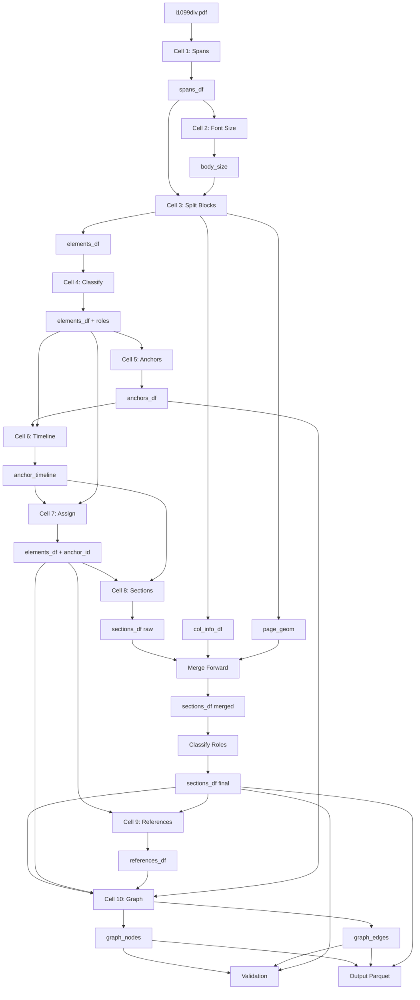

# run_pipeline.py Refactoring Map

**File:** `run_pipeline.py`
**Lines:** 2070
**Generated:** 2026-01-07

---

## Table of Contents

1. [Section Overview](#1-section-overview)
2. [Data Flow Diagram](#2-data-flow-diagram)
3. [Section Details](#3-section-details)
4. [Code Smells](#4-code-smells)
5. [Refactoring Recommendations](#5-refactoring-recommendations)

---

## 1. Section Overview

| # | Section | Lines | Description |
|---|---------|-------|-------------|
| 1 | CELL 1: Extract Spans | 25-83 | PDF → raw span extraction |
| 2 | CELL 2: Infer Body Font Size | 84-96 | Determine dominant body font |
| 3 | CELL 3: Split Blocks | 97-475 | Line geometry, column detection, header detection, element splitting |
| 3a | └─ Column Detection | 201-340 | Detect 1/2 columns per page |
| 3b | └─ Subsection Detection | 341-475 | Layout-driven subsection candidates |
| 4 | CELL 4: Classify Elements | 476-543 | Assign roles (BoxHeader, ListBlock, etc.) |
| 5 | CELL 5: Anchor Extraction | 544-776 | Parse box/section/subsection anchors |
| 6 | CELL 6: Build Timeline | 777-814 | Anchor reading order timeline |
| 7 | CELL 7: Assign Content | 815-866 | Map elements → anchors |
| 8 | CELL 8: Materialize Sections | 867-988 | Build section objects with text |
| 8a | └─ Merge-Forward | 989-1236 | Merge thin subsections forward |
| 8b | └─ Concept Role Classification | 1237-1277 | Classify subsection semantic roles |
| 9 | CELL 9: Extract References | 1278-1400 | Box/publication reference extraction |
| 10 | CELL 10: Emit Graph | 1401-1961 | Build nodes + edges |
| 10a | └─ Paragraph Nodes | 1444-1552 | Element-level nodes |
| 10b | └─ Structural Skeleton | 1553-1714 | Hierarchy + follows edges |
| 10c | └─ Anchor→Paragraph Edges | 1715-1749 | Parent edges |
| 10d | └─ Paragraph Follows | 1750-1785 | Reading order edges |
| 10e | └─ In-Section Edges | 1786-1837 | Section containment |
| 10f | └─ Reference Edges | 1838-1878 | Box reference edges |
| 10g | └─ Typed Edges | 1879-1937 | Semantic edges (excludes, includes, etc.) |
| 11 | Validation | 1962-2033 | Quality assessment |
| 12 | Output | 2034-2070 | Save parquet files |

---

## 2. Data Flow Diagram

```
                              ┌─────────────────┐
                              │   i1099div.pdf  │
                              └────────┬────────┘
                                       │
                              ┌────────▼────────┐
                              │  CELL 1: Spans  │
                              │   (spans_df)    │
                              └────────┬────────┘
                                       │
                              ┌────────▼────────┐
                              │  CELL 2: Font   │
                              │  (body_size)    │
                              └────────┬────────┘
                                       │
                    ┌──────────────────┼──────────────────┐
                    │                  │                  │
           ┌────────▼────────┐ ┌───────▼────────┐ ┌──────▼──────┐
           │   line_df       │ │   col_info_df  │ │  page_geom  │
           │  (line geom)    │ │   (columns)    │ │  (y-bounds) │
           └────────┬────────┘ └───────┬────────┘ └──────┬──────┘
                    │                  │                  │
                    └──────────────────┼──────────────────┘
                                       │
                              ┌────────▼────────┐
                              │  CELL 3: Split  │
                              │ (elements_df)   │
                              └────────┬────────┘
                                       │
                              ┌────────▼────────┐
                              │  CELL 4: Roles  │
                              │ (elements_df +  │
                              │     role col)   │
                              └────────┬────────┘
                                       │
                              ┌────────▼────────┐
                              │  CELL 5: Anchors│
                              │  (anchors_df)   │
                              └────────┬────────┘
                                       │
                              ┌────────▼────────┐
                              │  CELL 6: Timeline│
                              │(anchor_timeline)│
                              └────────┬────────┘
                                       │
                              ┌────────▼────────┐
                              │  CELL 7: Assign │
                              │ (elements_df +  │
                              │   anchor_id)    │
                              └────────┬────────┘
                                       │
                              ┌────────▼────────┐
                              │  CELL 8: Sections│
                              │  (sections_df)  │◄──── merge_forward_thin_subsections()
                              │                 │◄──── classify_section_roles()
                              └────────┬────────┘
                                       │
                              ┌────────▼────────┐
                              │  CELL 9: Refs   │
                              │(references_df)  │
                              └────────┬────────┘
                                       │
                    ┌──────────────────┼──────────────────┐
                    │                  │                  │
           ┌────────▼────────┐ ┌───────▼────────┐ ┌──────▼──────┐
           │  graph_nodes    │ │  graph_edges   │ │ sections_df │
           │   (parquet)     │ │  (parquet)     │ │ (parquet)   │
           └─────────────────┘ └────────────────┘ └─────────────┘
```

---

## 3. Section Details

### CELL 1: Extract Spans (Lines 25-83)

**Purpose:** Extract raw text spans from PDF with font/position metadata.

| Input | Output | Global State |
|-------|--------|--------------|
| `data/i1099div.pdf` (file) | `spans_df` | `doc` (fitz document) |
| - | `doc_id` (constant) | - |

**Functions Defined Inline:**
- `stable_hash(parts, length=16)` → SHA256 hash prefix
- `repair_hyphenation(text)` → Fix PDF line-break hyphens

**Dependencies:**
- `fitz` (PyMuPDF)

---

### CELL 2: Infer Body Font Size (Lines 84-96)

**Purpose:** Find dominant font size to distinguish headers from body text.

| Input | Output | Global State |
|-------|--------|--------------|
| `spans_df` | `body_size` (float) | - |

**Functions:** None

---

### CELL 3: Split Blocks on Header-Like Lines (Lines 97-475)

**Purpose:** Build line geometry, detect columns, identify headers, split blocks into elements.

| Input | Output | Global State |
|-------|--------|--------------|
| `spans_df` | `elements_df` | - |
| `body_size` | `col_info_df` | - |
| - | `page_geom` | - |
| - | `line_df_flags` | - |

**Functions Defined Inline:**
- `_safe_bbox(b)` → Safe bbox extraction
- `_is_bold(font, flags)` → Bold detection
- `_margin_tol(block_width)` → Margin tolerance calculation
- `detect_columns_for_page(page_df, min_peak_ratio)` → Column detection via x0 peaks

**Regex Constants:**
- `BOX_STRONG_RX`, `BOX_WEAK_RX` → Box header patterns
- `SECTION_HDR_RX` → Section header pattern
- `PAGE_MARKER_RX` → Page marker pattern (e.g., "-2-")
- `BULLET_RX`, `ENUM_RX` → List item patterns

**Imported Functions:**
- `detect_subsection_candidates(df)` from `vaas.extraction`
- `assign_split_triggers(df)` from `vaas.extraction`

---

### CELL 4: Classify Layout Elements (Lines 476-543)

**Purpose:** Assign semantic roles to elements based on split_kind and text patterns.

| Input | Output | Global State |
|-------|--------|--------------|
| `elements_df` | `elements_df` (+ role, role_conf) | - |

**Constants:**
- `ROLE_BOX_HEADER`, `ROLE_SECTION_HEADER`, `ROLE_SUBSECTION_HEADER`
- `ROLE_LIST_BLOCK`, `ROLE_PAGE_ARTIFACT`, `ROLE_BODY_TEXT`
- `PAGE_ARTIFACT_RX` → Artifact detection pattern

---

### CELL 5: Anchor Extraction + Normalization (Lines 544-776)

**Purpose:** Parse box/section/subsection headers into normalized anchor objects.

| Input | Output | Global State |
|-------|--------|--------------|
| `elements_df` | `anchors_df` | - |
| - | `box_headers` (filtered view) | - |
| - | `section_headers` (filtered view) | - |
| - | `subsection_headers` (filtered view) | - |

**Functions Defined Inline:**
- `parse_box_keys(text)` → Parse "Box 1a" into keys
- `slug_title(text, max_len)` → URL-safe slug from text

**Regex Constants:**
- `BOX_SINGLE_PARSE`, `BOX_RANGE_PARSE`, `BOX_DOUBLE_PARSE`, `BOX_THROUGH_PARSE`

**Constants:**
- `EXPECTED_BOXES_1099DIV` → Set of expected box keys
- `SECTION_ID_MAP` → Section text → canonical ID mapping

---

### CELL 6: Build Anchor Timeline (Lines 777-814)

**Purpose:** Build reading-order timeline of anchors with start/end ranges.

| Input | Output | Global State |
|-------|--------|--------------|
| `anchors_df` | `anchor_timeline` | - |
| `elements_df` | - | - |

---

### CELL 7: Assign Content to Anchors (Lines 815-866)

**Purpose:** Map each element to its containing anchor.

| Input | Output | Global State |
|-------|--------|--------------|
| `elements_df` | `elements_df` (+ anchor_id, anchor_ids) | - |
| `anchor_timeline` | - | - |

---

### CELL 8: Materialize Sections (Lines 867-988)

**Purpose:** Build section objects with aggregated text and metadata.

| Input | Output | Global State |
|-------|--------|--------------|
| `elements_df` | `sections_df` | - |
| `anchor_timeline` | - | - |

**Functions Defined Inline:**
- `sort_key(row)` → Section sort order

---

### Merge-Forward Thin Subsections (Lines 989-1236)

**Purpose:** Merge thin subsection fragments into subsequent anchors.

| Input | Output | Global State |
|-------|--------|--------------|
| `sections_df` | `sections_df` (merged) | - |
| `col_info_df` | - | - |
| `page_geom` | - | - |

**Functions Defined Inline:**
- `_bbox_y0(b)` → Extract y0 from bbox
- `merge_forward_thin_subsections(sdf, col_info, page_geom, ...)` → Main merge function
- `_page_num(p)` → Extract page number (nested)
- `_col_from_bbox(row)` → Determine column (nested)

---

### Concept Role Classification (Lines 1237-1277)

**Purpose:** Classify subsection semantic roles (definition, condition, etc.).

| Input | Output | Global State |
|-------|--------|--------------|
| `sections_df` | `sections_df` (+ concept_role cols) | - |

**Functions Defined Inline:**
- `classify_section_roles(sdf)` → Wrapper for role classification

**Imported Functions:**
- `classify_concept_role(header, body)` from `vaas.semantic.concept_roles`

---

### CELL 9: Extract References (Lines 1278-1400)

**Purpose:** Extract box/publication references from element text.

| Input | Output | Global State |
|-------|--------|--------------|
| `elements_df` | `references_df` | - |
| `sections_df` | - | - |

**Functions Defined Inline:**
- `parse_box_ref_keys(ref_text)` → Parse reference text into box keys
- `extract_evidence_quote(text, match, context_chars)` → Clean evidence extraction

**Regex Constants:**
- `BOX_REF_RX`, `PUB_REF_RX`, `IRC_REF_RX`, `FORM_REF_RX`

---

### CELL 10: Emit Graph (Lines 1401-1961)

**Purpose:** Build graph nodes and edges from sections, paragraphs, and references.

| Input | Output | Global State |
|-------|--------|--------------|
| `sections_df` | `graph_nodes` | - |
| `elements_df` | `graph_edges` | - |
| `references_df` | `paragraph_nodes_df` | - |
| `anchors_df` | - | - |

**Sub-sections:**
- **10a: Paragraph Nodes** (1444-1552) → Element-level node creation
- **10b: Structural Skeleton** (1553-1714) → Hierarchy + follows edges
- **10c: Anchor→Paragraph Edges** (1715-1749) → Parent edges
- **10d: Paragraph Follows** (1750-1785) → Reading order within anchor
- **10e: In-Section Edges** (1786-1837) → Section containment
- **10f: Reference Edges** (1838-1878) → Box reference edges
- **10g: Typed Edges** (1879-1937) → Semantic edges

**Functions Defined Inline:**
- `get_sort_key(row)` → Sort key for reading order

**Imported Functions:**
- `extract_typed_edges_from_section(...)` from `vaas.semantic.typed_edges`

**Constants:**
- `DOC_ID = "1099div_filer"`
- `SKIP_ROLES_PARA`, `HEADER_ROLES`

---

### Validation (Lines 1962-2033)

**Purpose:** Quality assessment and metrics.

| Input | Output | Global State |
|-------|--------|--------------|
| `graph_nodes` | (stdout) | - |
| `graph_edges` | - | - |
| `sections_df` | - | - |
| `references_df` | - | - |

---

### Output (Lines 2034-2070)

**Purpose:** Save parquet files.

| Input | Output | Global State |
|-------|--------|--------------|
| `graph_nodes` | `output/graph_nodes.parquet` | - |
| `graph_edges` | `output/graph_edges.parquet` | - |
| `sections_df` | `output/sections.parquet` | - |

**Functions Defined Inline:**
- `normalize_cell_list(x)` → Normalize arrays to lists
- `normalize_bbox(b)` → Normalize bbox to 4-element list

---

## 4. Code Smells

### 4.1 Functions That Should Be Extracted

| Location | Current Code | Recommendation |
|----------|--------------|----------------|
| Lines 32-46 | `stable_hash()`, `repair_hyphenation()` inline | → `vaas.utils.text` |
| Lines 138-150 | `_safe_bbox()`, `_is_bold()` inline | → `vaas.extraction.geometry` |
| Lines 180-181 | `_margin_tol()` inline | → `vaas.extraction.geometry` |
| Lines 215-273 | `detect_columns_for_page()` inline (59 lines) | → `vaas.extraction.columns` |
| Lines 562-596 | `parse_box_keys()` inline | → `vaas.extraction.anchors` |
| Lines 682-689 | `slug_title()` inline | → `vaas.utils.text` |
| Lines 995-1228 | `merge_forward_thin_subsections()` inline (233 lines!) | → `vaas.extraction.merge` |
| Lines 1244-1262 | `classify_section_roles()` inline | → `vaas.semantic.concept_roles` |
| Lines 1295-1319 | `parse_box_ref_keys()`, `extract_evidence_quote()` | → `vaas.extraction.references` |
| Lines 1593-1609 | `get_sort_key()` inline | → `vaas.extraction.geometry` |
| Lines 2039-2056 | `normalize_cell_list()`, `normalize_bbox()` | → `vaas.utils.serialize` |

### 4.2 Repeated Patterns

| Pattern | Occurrences | Lines |
|---------|-------------|-------|
| Safe page extraction from array/scalar | 5 | 1056-1062, 1596-1601, 1628-1634, etc. |
| Safe bbox extraction | 4 | 138-144, 995-1002, 1603-1608 |
| Array normalization for parquet | 3 | 2039-2056, 1213-1226, 1163-1170 |
| DataFrame filtering + groupby print | 6 | Various validation sections |
| Edge append pattern | 8+ | 1679-1691, 1695-1707, 1734-1745, etc. |

### 4.3 Hardcoded Values That Should Be Config

| Value | Location | Recommendation |
|-------|----------|----------------|
| `"data/i1099div.pdf"` | Line 48 | CLI arg or config |
| `"1099div_filer"` | Line 50, 1408 | Derive from filename |
| `PAGE_MID_X = 300.0` | Line 456 | Config (varies by PDF) |
| `body_size + 0.5` | Line 191 | Config: `header_size_delta` |
| `thin_char_thresh=160` | Line 1007 | Config |
| `thin_elem_thresh=2` | Line 1008 | Config |
| `body_char_thresh=120` | Line 1009 | Config |
| `context_chars=50` | Line 1308 | Config |
| `EXPECTED_BOXES_1099DIV` | Lines 551-555 | External schema file |
| `SECTION_ID_MAP` | Lines 632-643 | External schema file |

### 4.4 Dead Code / Redundant Computation

| Location | Issue |
|----------|-------|
| Line 368 | `_norm_text` column created but only used once |
| Lines 316-317 | Cleanup columns that may not exist (uses `errors="ignore"`) |
| Line 456 | `PAGE_MID_X` constant redefined when `col_split_x` already exists |
| Line 2011-2012 | `box_node_ids` computed twice with different logic |
| Line 1891 | `typed_edge_counts` includes "includes" but excludes "qualifies" from initial keys |

### 4.5 Global State / Side Effects

| Variable | Scope | Issue |
|----------|-------|-------|
| `doc` | Module | PyMuPDF document handle (not closed) |
| `body_size` | Module | Used in multiple sections |
| `col_info_df` | Module | Created in Cell 3, used in Cell 8a |
| `page_geom` | Module | Created in Cell 3, used in Cell 8a |
| `line_df_flags` | Module | Intermediate, could be scoped |
| `anchor_meta` | Cell 10 | Built and consumed within Cell 10 |

### 4.6 Long Functions

| Function | Lines | Recommendation |
|----------|-------|----------------|
| `merge_forward_thin_subsections()` | 233 | Split into: detect_thin(), compute_merge_target(), perform_merge() |
| `detect_columns_for_page()` | 59 | Extract peak detection logic |
| Cell 3 block splitting loop | 80 | Extract to `split_blocks_into_elements()` |
| Cell 10 edge emission | 400+ | Split into discrete edge type functions |

---

## 5. Refactoring Recommendations

### 5.1 Proposed Module Structure

```
vaas/
├── extraction/
│   ├── __init__.py
│   ├── pdf.py           # span extraction, doc handling
│   ├── geometry.py      # bbox, margin, column detection
│   ├── elements.py      # block splitting, element creation
│   ├── anchors.py       # anchor parsing, timeline building
│   ├── sections.py      # section materialization
│   ├── merge.py         # thin subsection merging
│   └── references.py    # reference extraction
├── graph/
│   ├── __init__.py
│   ├── nodes.py         # node creation (sections, paragraphs)
│   ├── edges.py         # edge creation (structural, reference, typed)
│   └── validation.py    # graph quality checks
├── semantic/
│   ├── concept_roles.py # (existing)
│   └── typed_edges.py   # (existing)
└── utils/
    ├── text.py          # repair_hyphenation, slug_title, stable_hash
    └── serialize.py     # normalize_cell_list, normalize_bbox
```

### 5.2 Configuration Object

```python
@dataclass
class PipelineConfig:
    # Input
    pdf_path: Path
    doc_id: str = None  # Auto-derive from filename

    # Font detection
    header_size_delta: float = 0.5

    # Column detection
    column_min_peak_ratio: float = 0.25
    column_min_distance_pct: float = 0.25

    # Merge-forward
    thin_char_thresh: int = 160
    thin_elem_thresh: int = 2
    body_char_thresh: int = 120

    # Reference extraction
    evidence_context_chars: int = 50

    # Validation
    expected_boxes: Set[str] = None  # Load from schema

    # Output
    output_dir: Path = Path("output")
```

### 5.3 Pipeline Class Structure

```python
class ExtractionPipeline:
    def __init__(self, config: PipelineConfig):
        self.config = config
        self.spans_df = None
        self.elements_df = None
        self.anchors_df = None
        self.sections_df = None
        self.references_df = None
        self.graph_nodes = None
        self.graph_edges = None

    def run(self) -> Tuple[pd.DataFrame, pd.DataFrame]:
        self.extract_spans()
        self.infer_body_size()
        self.build_elements()
        self.classify_elements()
        self.extract_anchors()
        self.build_timeline()
        self.assign_content()
        self.materialize_sections()
        self.merge_thin_sections()
        self.classify_roles()
        self.extract_references()
        self.emit_graph()
        self.validate()
        self.save()
        return self.graph_nodes, self.graph_edges
```

### 5.4 Priority Refactoring Tasks

| Priority | Task | Effort | Impact |
|----------|------|--------|--------|
| P0 | Extract `merge_forward_thin_subsections()` to `vaas.extraction.merge` | Medium | High (233 lines) |
| P0 | Create `PipelineConfig` dataclass | Low | High (removes hardcoding) |
| P1 | Extract Cell 10 edge emission into `vaas.graph.edges` | High | High (cleaner separation) |
| P1 | Extract `detect_columns_for_page()` to `vaas.extraction.geometry` | Low | Medium |
| P2 | Create `vaas.utils.text` module | Low | Low (consolidation) |
| P2 | Add CLI argument parsing | Low | Medium (usability) |
| P3 | Extract validation to `vaas.graph.validation` | Medium | Medium |
| P3 | Load `EXPECTED_BOXES_*` from external schema | Low | Medium |

### 5.5 Testing Strategy

After refactoring, add unit tests for:

1. **geometry.py**: `_safe_bbox()`, `detect_columns_for_page()`, column assignment
2. **anchors.py**: `parse_box_keys()` with edge cases (ranges, "through", doubles)
3. **merge.py**: `merge_forward_thin_subsections()` with mock sections
4. **edges.py**: Edge creation for each type
5. **Integration**: Full pipeline on test PDF, assert node/edge counts

---

## Appendix: Dependency Graph (Mermaid)


